# 03. 사용자 플로우 (User Flow)

> Palette AI - 회사 메신저 + AI 통합 플랫폼
> MVP 범위: 경영지원팀 휴가 관리

---

## MVP 캡슐 요약

| # | 항목 | 내용 |
|---|------|------|
| 1 | **목표** | AI가 HR 반복 업무를 자동 처리하는 회사 메신저 구축 |
| 2 | **페르소나** | 대표, 경영지원팀장, 휴가 담당자, 직원 A(정인수), 상사(김민준) |
| 3 | **핵심 기능** | FEAT-1: 메신저+AI 자동응답, FEAT-2: 휴가 신청/결재 시스템 |
| 4 | **성공 지표** | 시나리오 A/B/C 전체 E2E 동작 |
| 5 | **입력 지표** | AI 자동 처리율, 평균 처리 시간 |
| 6 | **비기능 요구** | 실시간 메시지 전달 < 500ms, 웹+모바일 반응형 |
| 7 | **Out-of-scope** | 네이티브 앱, B2B SaaS 멀티테넌시, Google Calendar 연동 |
| 8 | **Top 리스크** | LLM 할루시네이션으로 잘못된 업무 처리 |
| 9 | **완화/실험** | Tool 호출 강제 + 응답 검증 + Human Takeover |
| 10 | **다음 단계** | Phase 2 프로젝트 셋업 |

---

## 1. 전체 사용자 여정 (Overall User Journey)

사용자가 앱에 진입하여 주요 기능에 도달하기까지의 흐름입니다.

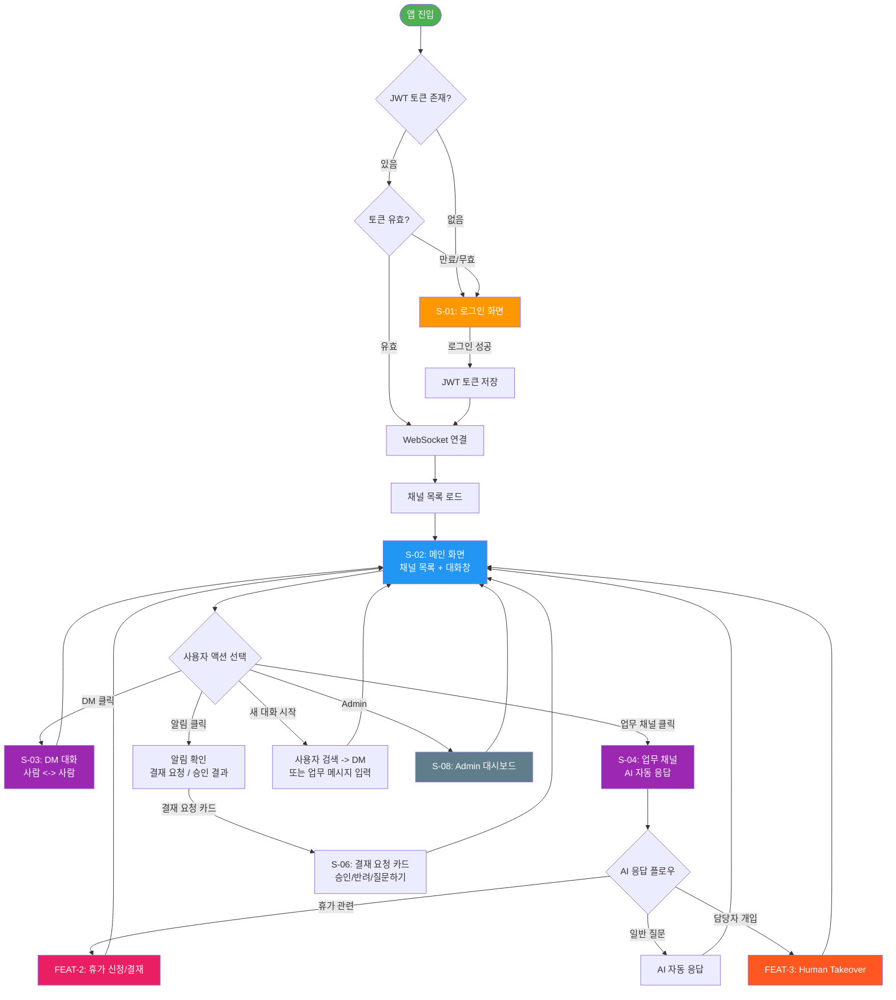

---

## 2. FEAT-0: 로그인 플로우

JWT 기반 이메일/비밀번호 인증 후 WebSocket 연결까지의 흐름입니다.

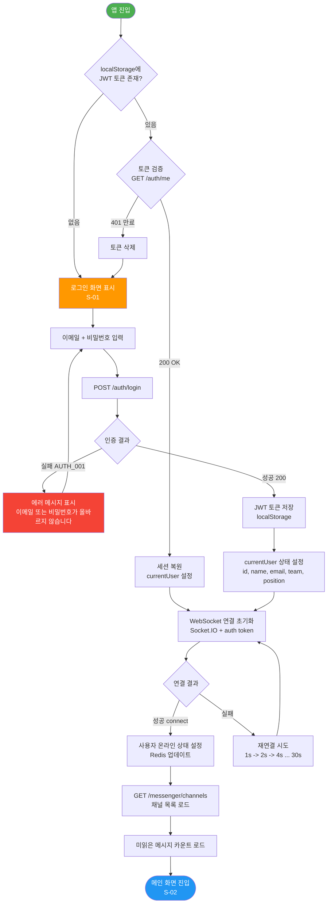

### 로그인 데이터 흐름

| 단계 | 엔드포인트 | 설명 |
|------|-----------|------|
| 1 | `POST /auth/login` | 이메일+비밀번호 -> JWT 토큰 + 사용자 정보 |
| 2 | localStorage | JWT 토큰 영속 저장 |
| 3 | Socket.IO `auth: { token }` | WebSocket 핸드셰이크 시 JWT 전달 |
| 4 | `GET /messenger/channels` | 내 채널 목록 (DM, 업무, 팀, 알림) |

---

## 3. FEAT-1: 메신저 + AI 자동응답 플로우

모든 메시지가 messaging-server를 거치며, 채널 유형에 따라 라우팅됩니다.

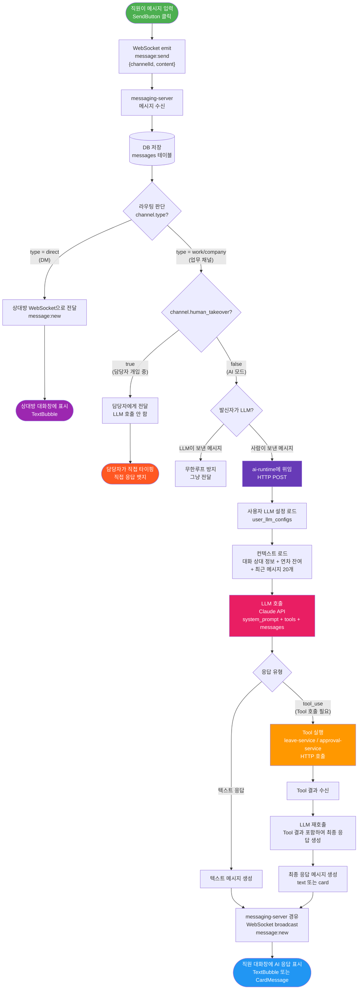

### 라우팅 규칙 요약

| 조건 | 라우팅 | LLM 관여 |
|------|--------|---------|
| `channel.type = 'direct'` | 상대방에게 직접 전달 | 없음 |
| `channel.human_takeover = true` | 담당자에게 전달, LLM 중지 | 없음 |
| `sender.type = 'llm'` | 무한루프 방지, 그냥 전달 | 없음 |
| `channel.type = 'work'/'company'` + 사람 발신 | ai-runtime에 위임 | LLM 응답 |

### LLM 파이프라인 단계

| 단계 | 처리 | 비고 |
|------|------|------|
| 1 | LLM 설정 로드 | `user_llm_configs` 테이블에서 system_prompt, tools 조회 |
| 2 | 컨텍스트 주입 | 대화 상대 정보, 연차 잔여, 최근 대화 20건 |
| 3 | Claude API 호출 | model, system, messages, tools 전달 |
| 4 | Tool 실행 (선택) | `tool_use` 응답 시 내부 API 호출 |
| 5 | 최종 응답 생성 | Tool 결과를 포함하여 LLM 재호출 |
| 6 | WebSocket 전달 | messaging-server를 통해 클라이언트로 push |

---

## 4. FEAT-2: 휴가 신청/결재 플로우 (시나리오 A 기반)

직원 A(정인수)가 휴가를 신청하고 상사(김민준)가 승인하는 전체 흐름입니다.

```mermaid
flowchart TD
    %% Step 1: 연차 조회
    subgraph STEP1["Step 1: 연차 잔여 조회"]
        A1([직원 A: 휴가 몇개 남았어?]) --> A2[messaging-server 수신]
        A2 --> A3["라우터 LLM 호출\nanalyze_intent"]
        A3 --> A4["의도: leave_inquiry\nroute_to: leave_agent"]
        A4 --> A5[휴가 담당 채널 연결\nassigned_llm = EMP-HR-001]
    end

    %% Step 2: 잔여 응답
    subgraph STEP2["Step 2: 연차 잔여 응답"]
        A5 --> B1["휴가 담당 LLM 호출\nsystem_prompt + tools"]
        B1 --> B2["Tool: query_leave_balance\nGET /leave/balance/EMP-001"]
        B2 --> B3["결과: total=15, used=1\nremaining=14"]
        B3 --> B4["LLM 최종 응답 생성\n15개 중 14개 남았습니다"]
        B4 --> B5([S-05: 연차 현황 카드 표시\nLeaveBalanceCard])
    end

    %% Step 3: 휴가 신청 시작
    subgraph STEP3["Step 3: 날짜 검증 + 사유 확인"]
        B5 --> C1([직원 A: 나 3월 18일에 휴가 쓰고 싶어])
        C1 --> C2["휴가 담당 LLM\nTool: validate_date\nPOST /leave/validate-date\n{employee_id, date: 2026-03-18}"]
        C2 --> C3{날짜 유효?}
        C3 -->|"valid: true\n수요일"| C4["LLM: 어떤 이유로 휴가를\n쓰실 예정이신가요?"]
        C3 -->|"valid: false\n주말/공휴일"| C5["LLM: 대안 날짜 제시\nE-02 처리"]
        C5 --> C1
        C4 --> C6([직원 A: 개인사정이야])
    end

    %% Step 4: 신청 확정
    subgraph STEP4["Step 4: 휴가 신청 확정"]
        C6 --> D1["LLM: 네 휴가 올려드릴게요~"]
        D1 --> D2["Tool: submit_leave_request\nPOST /leave/request\n{EMP-001, 2026-03-18, 1일, 개인사정}"]
        D2 --> D3["DB 처리:\n1. leave_requests INSERT (LV-2026-0001)\n2. approvals INSERT (APR-2026-0031)\n3. leave_balances.pending_days += 1"]
        D3 --> D4["LLM: 신청 완료!\n승인자: 김민준 팀장님"]
    end

    %% Step 5: 상사 알림
    subgraph STEP5["Step 5: 상사에게 결재 요청"]
        D4 --> E1["messaging-server\n상사(김민준)에게 알림 전송\nWebSocket approval:new"]
        E1 --> E2["상사 LLM 자동 분석\ncheck_team_schedule\ncheck_team_leaves"]
        E2 --> E3([S-06: ApprovalCard 표시\n신청자/날짜/사유/AI 검토 결과\n승인 반려 질문하기])
    end

    %% Step 6: 승인
    subgraph STEP6["Step 6: 상사 승인 처리"]
        E3 --> F1{상사 액션}
        F1 -->|"승인 클릭"| F2["POST /approvals/APR-2026-0031/decide\n{decision: approved}"]
        F1 -->|"반려 클릭"| F3["사유 입력 모달\nPOST /approvals/decide\n{decision: rejected, comment}"]
        F1 -->|"질문하기"| F4["텍스트 입력 활성화\n결재 상태 reviewing\n자동승인 타이머 일시정지"]

        F2 --> F5["DB 업데이트:\n1. leave_requests.status = approved\n2. leave_balances.used_days += 1\n3. leave_balances.pending_days -= 1\n4. 캘린더 이벤트 등록"]

        F5 --> F6["알림 전송:\n1. 정인수: 휴가 승인되었습니다!\n2. 휴가 담당자: 승인 완료\n3. 경영지원팀장: 승인 완료"]

        F6 --> F7["감사 로그 기록\naudit_log INSERT"]
        F7 --> F8([직원 A 대화창:\n휴가가 승인되었습니다!])

        F3 --> F9["DB: status = rejected\npending_days 원복"]
        F9 --> F10([직원 A: 반려 알림\n사유 + 날짜 변경 안내])
    end

    style A1 fill:#4CAF50,color:#fff
    style B5 fill:#2196F3,color:#fff
    style C1 fill:#4CAF50,color:#fff
    style C6 fill:#4CAF50,color:#fff
    style E3 fill:#FF9800,color:#fff
    style F8 fill:#2196F3,color:#fff
    style F10 fill:#f44336,color:#fff
```

### 휴가 신청 데이터 흐름 요약

| Step | 사용자 액션 | Tool / API | DB 변경 |
|------|-----------|-----------|---------|
| 1 | "휴가 몇개 남았어?" | `analyze_intent` (라우터) | - |
| 2 | - | `query_leave_balance` -> `GET /leave/balance/EMP-001` | - |
| 3 | "3월 18일 휴가" | `validate_date` -> `POST /leave/validate-date` | - |
| 4 | "개인사정" + 확인 | `submit_leave_request` -> `POST /leave/request` | leave_requests, approvals, leave_balances |
| 5 | - | messaging-server 알림 | - |
| 6 | 상사 [승인] | `POST /approvals/:id/decide` | leave_requests, leave_balances, audit_log |

### 자동 승인 타임아웃 (E-10)

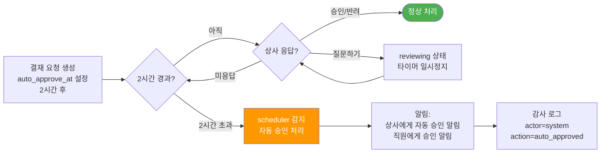

---

## 5. FEAT-3: Human Takeover 플로우

담당자(사람)가 AI 자동 응답을 모니터링하다가 직접 개입하는 흐름입니다.

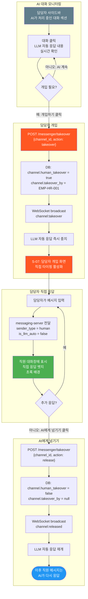

### Human Takeover 상태 전환

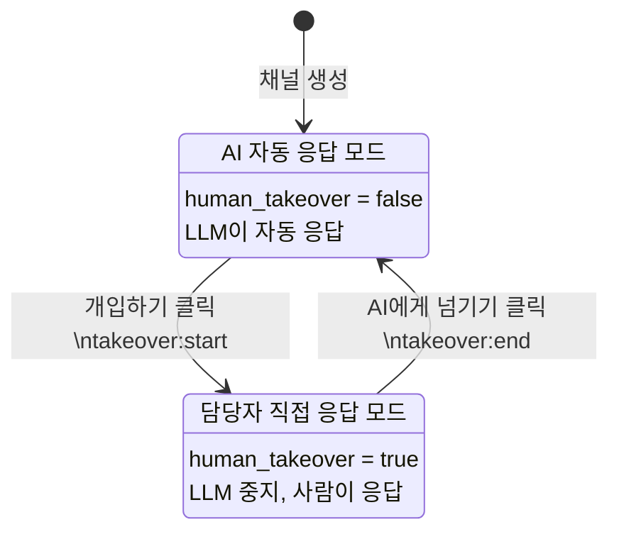

### WebSocket 이벤트 시퀀스

| 순서 | 이벤트 | 방향 | 내용 |
|------|--------|------|------|
| 1 | `takeover:start` | 클라이언트 -> 서버 | 담당자가 개입 요청 |
| 2 | `channel:takeover` | 서버 -> 모든 참여자 | 채널 상태 변경 알림 |
| 3 | `message:new` | 서버 -> 직원 | 담당자 직접 응답 (직접 응답 뱃지) |
| 4 | `takeover:end` | 클라이언트 -> 서버 | 담당자가 AI에게 넘기기 |
| 5 | `channel:released` | 서버 -> 모든 참여자 | 채널 상태 복원 알림 |

---

## 6. 에러 처리 플로우

### 6-1. 휴가 신청 에러 (E-01 ~ E-04)

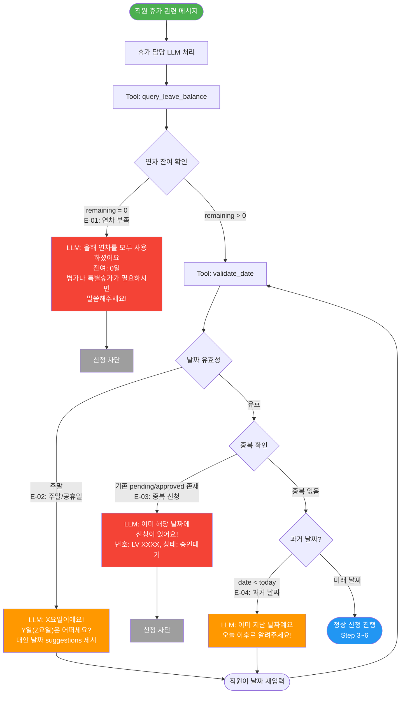

### 6-2. LLM 실패 (E-14)

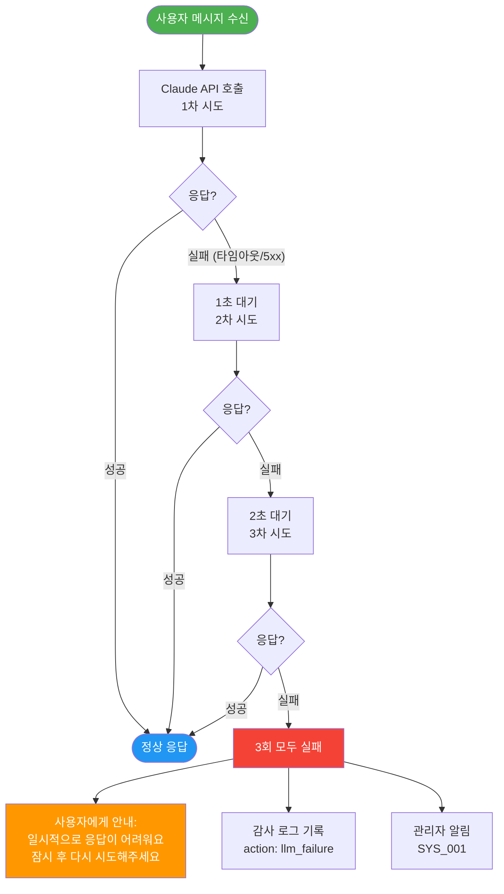

### 6-3. WebSocket 끊김 (E-17)

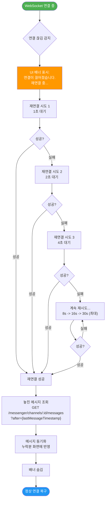

### 에러 코드 빠른 참조

| 코드 | ID | HTTP | 상황 | 사용자 메시지 |
|------|-----|------|------|-------------|
| E-01 | LV_001 | 400 | 연차 부족 | 연차가 부족합니다 |
| E-02 | LV_002 | 400 | 주말/공휴일 | 해당 날짜는 주말/공휴일입니다 |
| E-03 | LV_003 | 409 | 중복 신청 | 이미 신청이 있습니다 |
| E-04 | LV_004 | 400 | 과거 날짜 | 과거 날짜는 신청 불가 |
| E-14 | SYS_001 | 503 | LLM 호출 실패 | 잠시 후 재시도해주세요 |
| E-17 | - | - | WebSocket 끊김 | 연결이 끊어졌습니다. 재연결 중... |

---

## 7. 화면 목록 (Screen Inventory)

| Screen | FEAT | 화면명 | 설명 | 주요 컴포넌트 |
|--------|------|--------|------|-------------|
| S-01 | FEAT-0 | 로그인 | 이메일 + 비밀번호 JWT 인증 | LoginForm, EmailInput, PasswordInput |
| S-02 | FEAT-1 | 메인 (채널목록 + 대화창) | 앱의 기본 레이아웃 | Sidebar, ChannelList, ChatPanel |
| S-03 | FEAT-1 | DM 대화 | 사람과 사람의 1:1 대화 | MessageList, TextBubble, MessageInput |
| S-04 | FEAT-1 | 업무 채널 (AI 응답) | AI가 자동 응답하는 업무 대화 | TextBubble([AI] 뱃지), TypingIndicator |
| S-05 | FEAT-2 | 연차 현황 카드 | 연차 잔여 현황 카드 표시 | LeaveBalanceCard(total, used, remaining) |
| S-06 | FEAT-2 | 결재 요청 카드 | 상사에게 표시되는 승인/반려 카드 | ApprovalCard, [승인], [반려], [질문하기] |
| S-07 | FEAT-3 | 담당자 개입 화면 | 담당자가 AI 대화에 직접 개입 | TakeoverButton, [직접 응답] 뱃지 |
| S-08 | FEAT-4 | Admin 대시보드 | 직원 관리, 연차 설정, 감사 로그 | DataTable, Charts, SettingsForms |

### 화면별 FEAT 매핑

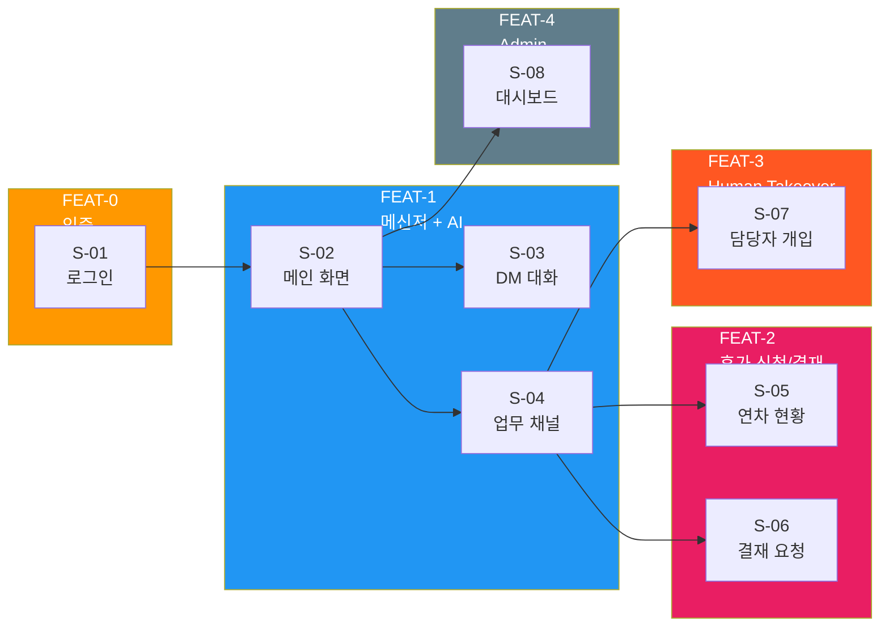

### 화면 상세 와이어프레임 참조

#### S-01: 로그인 화면

```
+----------------------------------+
|         Palette AI               |
|                                  |
|   +----------------------------+ |
|   | Email                      | |
|   +----------------------------+ |
|   | Password                   | |
|   +----------------------------+ |
|   |        [로그인]             | |
|   +----------------------------+ |
|                                  |
+----------------------------------+
```

#### S-02: 메인 화면 (채널목록 + 대화창)

```
+------------+-------------------------+
| [Profile]  | # 휴가 상담         [...] |
|------------|--------------------------|
| DM         | +----------------------+ |
|  김민준  2  | | 정인수: 휴가 몇개    | |
|  대표       | | 남았어?              | |
|------------|  |                      | |
| 업무    AI  | | [AI] 휴가 담당:      | |
|  휴가 상담  | | 15개 중 14개         | |
|  일정 조회  | | 남았습니다           | |
|------------|  |  [연차 현황 카드]    | |
| AI 처리중   | |                      | |
|  직원B 상담 | +----------------------+ |
|            | +----------------------+ |
|            | | 메시지 입력...  [>]  | |
|            | +----------------------+ |
+------------+-------------------------+
```

#### S-06: 결재 요청 카드 (ApprovalCard)

```
+-------------------------------+
| 휴가 승인 요청                 |
|-------------------------------|
| 신청자: 정인수 (개발팀)        |
| 날짜: 3/18(수) 연차 1일       |
| 사유: 개인사정                 |
|-------------------------------|
| AI 검토:                       |
|  - 팀 일정 충돌 없음           |
|  - 동일 날짜 팀원 휴가 없음    |
|  -> 승인 추천                  |
|-------------------------------|
| 2시간 후 자동승인              |
|                               |
| [승인] [반려] [질문하기]       |
+-------------------------------+
```

---

## 부록: 시나리오 B/C 요약 플로우

### 시나리오 B: 대표 일정 조회 + 팀장 호출

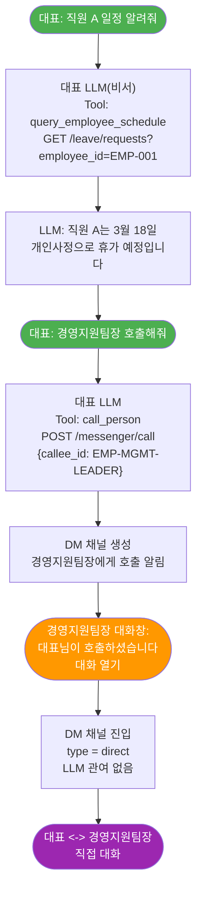

### 시나리오 C: 담당자 직접 개입

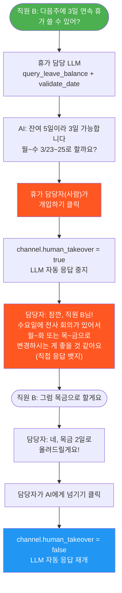

---

## 변경 이력

| 날짜 | 버전 | 변경 내용 |
|------|------|----------|
| 2026-03-16 | v1.0 | 최초 작성 - 전체 사용자 플로우 7개 섹션 |
