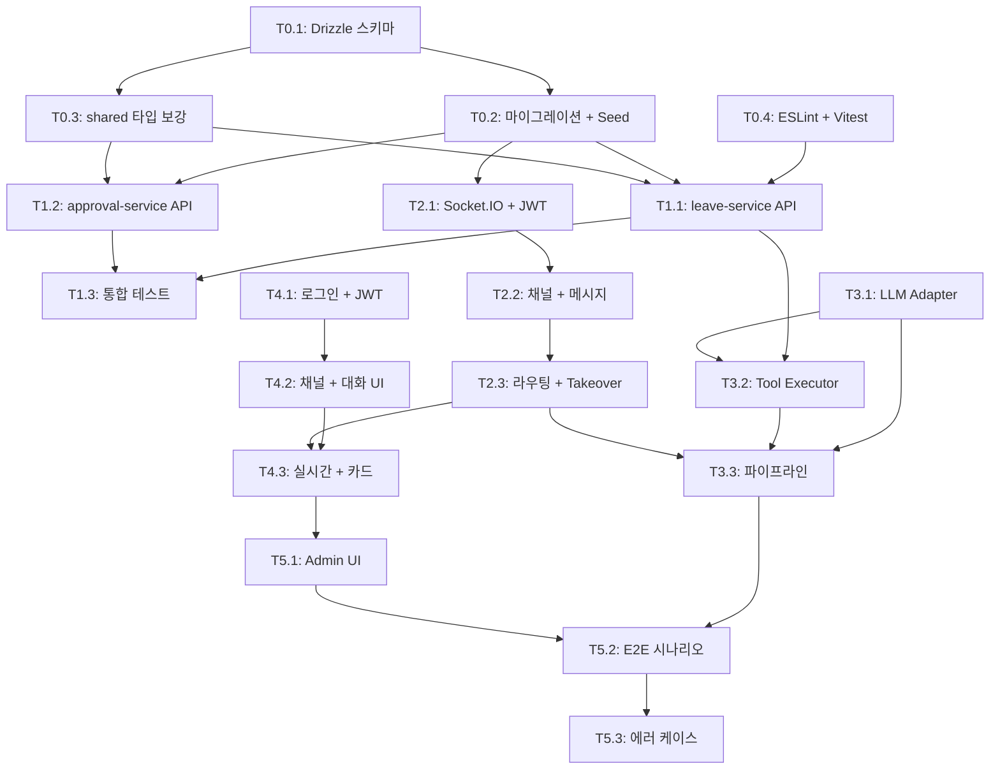

# TASKS: Palette AI - AI 개발 파트너용 태스크 목록

## MVP 캡슐

1. **목표**: AI가 HR 반복 업무를 자동 처리하는 회사 메신저 구축
2. **페르소나**: 대표, 경영지원팀장, 휴가 담당자, 직원 A(정인수), 상사(김민준)
3. **핵심 기능**: FEAT-1 메신저+AI 자동응답, FEAT-2 휴가 신청/결재 시스템
4. **성공 지표**: 시나리오 A/B/C 전체 E2E 동작
5. **입력 지표**: AI 자동 처리율, 평균 처리 시간
6. **비기능 요구**: 실시간 메시지 전달 < 500ms, 웹+모바일 반응형
7. **Out-of-scope**: 네이티브 앱, B2B SaaS 멀티테넌시, Google Calendar 연동
8. **Top 리스크**: LLM 할루시네이션으로 잘못된 업무 처리
9. **완화/실험**: Tool 호출 강제 + 응답 검증 + Human Takeover
10. **다음 단계**: M0부터 순차 개발 (TDD)

---

## 마일스톤 개요

| 마일스톤 | 설명 | Phase | 주요 기능 |
|----------|------|-------|----------|
| M0 | 프로젝트 셋업 | 0 | DB 스키마, 공통 패키지, 인프라 |
| M1 | DB + 비즈니스 서비스 | 1 | leave-service, approval-service API |
| M2 | 메시징 서버 | 2 | Socket.IO, 메시지 라우팅, Human Takeover |
| M3 | AI 런타임 | 3 | LLM Adapter, Tool Executor, 파이프라인 |
| M4 | 메신저 프론트엔드 | 4 | 로그인, 채팅 UI, 실시간 메시지 |
| M5 | Admin + 통합 테스트 | 5 | Admin UI, 시나리오 A/B/C 전체 검증 |

---

## M0: 프로젝트 셋업

### [] Phase 0, T0.1: Drizzle 스키마 정의 (13개 테이블)

**담당**: database-specialist

**작업 내용**:
- docs/DATABASE.md + docs/planning/04-database-design.md 참조
- packages/db/src/schema/ 에 13개 테이블 Drizzle 스키마 정의
- teams, employees, user_llm_configs, channels, messages
- leave_policies, leave_balances, leave_requests, approvals
- holidays, audit_log, leave_accrual_log
- relations.ts에 모든 FK 관계 정의
- ID 생성 규칙: EMP-XXX, TEAM-XXX, LV-YYYY-NNNN, APR-YYYY-NNNN, ch-{uuid}
- leave_balances.remaining_days GENERATED ALWAYS AS STORED

**산출물**:
- `packages/db/src/schema/teams.ts`
- `packages/db/src/schema/employees.ts`
- `packages/db/src/schema/user-llm-configs.ts`
- `packages/db/src/schema/channels.ts`
- `packages/db/src/schema/messages.ts`
- `packages/db/src/schema/leave-policies.ts`
- `packages/db/src/schema/leave-balances.ts`
- `packages/db/src/schema/leave-requests.ts`
- `packages/db/src/schema/approvals.ts`
- `packages/db/src/schema/holidays.ts`
- `packages/db/src/schema/audit-log.ts`
- `packages/db/src/schema/leave-accrual-log.ts`
- `packages/db/src/schema/relations.ts`
- `packages/db/src/schema/index.ts`

**완료 조건**:
- [ ] 13개 테이블 스키마 정의 완료
- [ ] drizzle-kit generate 성공 (마이그레이션 SQL 생성)
- [ ] TypeScript 타입 체크 통과

---

### [] Phase 0, T0.2: 마이그레이션 + Seed 데이터

**담당**: database-specialist

**의존성**: T0.1

**작업 내용**:
- drizzle-kit generate로 마이그레이션 SQL 생성
- drizzle-kit migrate로 PostgreSQL에 적용
- packages/db/src/seed.ts 구현:
  - 팀: TEAM-001 경영지원팀
  - 직원 5명: EMP-001(정인수), EMP-002(김민준), EMP-HR-001(휴가담당), EMP-MGMT-LEADER(팀장), EMP-CEO(대표)
  - 비밀번호: bcrypt 해싱
  - 연차 정책: 기본 15일
  - leave_balances: 5명 각각 초기 잔여 설정
  - 2026년 공휴일 (holidays 테이블)
  - user_llm_configs: 5명 각 LLM 역할 (router, work_assistant, approver, secretary, team_assistant)
  - 기본 채널: 전사 공지, 경영지원팀, 알림 채널

**산출물**:
- `packages/db/drizzle/` (마이그레이션 SQL)
- `packages/db/src/seed.ts`

**완료 조건**:
- [ ] docker compose up -d로 PostgreSQL 실행
- [ ] pnpm db:migrate 성공
- [ ] pnpm db:seed 성공
- [ ] psql로 데이터 확인 (5명 직원, 공휴일, 연차 정책)

---

### [] Phase 0, T0.3: packages/shared 타입 + 에러 보강

**담당**: backend-specialist

**작업 내용**:
- packages/shared/src/types/index.ts 보강:
  - docs/API.md의 Request/Response 타입 추가
  - Zod 스키마 추가 (API 입력 검증용)
  - DB 엔티티 -> API 응답 변환 타입
- packages/shared/src/errors/index.ts 보강:
  - AppError 클래스 HTTP 상태 코드 매핑
  - 에러 응답 포맷터
- packages/shared/src/utils/ 추가:
  - 날짜 유틸 (비즈니스일 계산, 주말 판별)
  - ID 생성 유틸 (EMP-XXX, LV-YYYY-NNNN 패턴)

**산출물**:
- `packages/shared/src/types/index.ts` (보강)
- `packages/shared/src/types/api.ts` (API 전용 타입)
- `packages/shared/src/errors/index.ts` (보강)
- `packages/shared/src/utils/date.ts`
- `packages/shared/src/utils/id-generator.ts`
- `packages/shared/src/schemas/index.ts` (Zod 스키마)

**완료 조건**:
- [ ] 모든 API Request/Response 타입 정의
- [ ] Zod 스키마로 입력 검증 가능
- [ ] 타입 체크 통과

---

### [] Phase 0, T0.4: ESLint + Prettier + Vitest 설정

**담당**: test-specialist

**작업 내용**:
- 루트 ESLint 설정 (.eslintrc.cjs 또는 eslint.config.mjs)
- Prettier 설정 (.prettierrc)
- Vitest 글로벌 설정 (vitest.workspace.ts)
- 각 서비스/패키지에 vitest.config.ts
- tsconfig.base.json에서 상속하는 각 패키지 tsconfig 검증
- pnpm scripts 검증 (lint, type-check, test, build)

**산출물**:
- `eslint.config.mjs` (루트)
- `.prettierrc` (루트)
- `vitest.workspace.ts` (루트)
- 각 서비스/패키지의 `vitest.config.ts`

**완료 조건**:
- [ ] pnpm lint 성공 (모든 패키지)
- [ ] pnpm type-check 성공
- [ ] pnpm test 실행 가능 (아직 테스트 0개여도 에러 없음)

---

## M1: DB + 비즈니스 서비스

### [] Phase 1, T1.1: leave-service API 구현 RED->GREEN

**담당**: backend-specialist

**Git Worktree 설정**:
```bash
git worktree add ../palette-phase1-leave-service -b phase/1-leave-service
cd ../palette-phase1-leave-service
```

**TDD 사이클**:

1. **RED**: 테스트 작성 (실패 확인)
   ```bash
   # 테스트 파일: services/leave-service/tests/leave.test.ts
   pnpm --filter @palette/leave-service test  # Expected: FAILED
   ```
   테스트 항목:
   - GET /leave/balance/:employeeId - 연차 잔여 조회
   - GET /leave/balance/:employeeId/history - 사용 내역
   - POST /leave/requests - 휴가 신청 (정상)
   - POST /leave/requests - 연차 부족 (LV_001)
   - POST /leave/requests - 중복 신청 (LV_003)
   - POST /leave/validate-dates - 날짜 검증 (주말, 공휴일, 과거)
   - PATCH /leave/requests/:id/cancel - 신청 취소
   - GET /leave/holidays?year=2026 - 공휴일 목록
   - GET /leave/team-schedule - 팀 휴가 현황

2. **GREEN**: 최소 구현 (테스트 통과)
   ```bash
   # 구현 파일: services/leave-service/src/routes/leave.ts
   # 구현 파일: services/leave-service/src/services/leave-service.ts
   # 구현 파일: services/leave-service/src/services/balance-service.ts
   pnpm --filter @palette/leave-service test  # Expected: PASSED
   ```

3. **REFACTOR**: 리팩토링 (테스트 유지)
   - Zod 스키마 검증 미들웨어 적용
   - AppError 에러 핸들링 통합
   - 트랜잭션 패턴 정리

**Quality Gate**:
- [ ] 빌드 성공: `pnpm --filter @palette/leave-service build`
- [ ] 테스트 통과: `pnpm --filter @palette/leave-service test`
- [ ] 린트 통과: `pnpm --filter @palette/leave-service lint`
- [ ] 타입 체크 통과
- [ ] 커버리지 >= 80%

**산출물**:
- `services/leave-service/tests/leave.test.ts`
- `services/leave-service/src/routes/leave.ts`
- `services/leave-service/src/routes/balance.ts`
- `services/leave-service/src/services/leave-service.ts`
- `services/leave-service/src/services/balance-service.ts`
- `services/leave-service/src/schemas/leave.ts`

**인수 조건**:
- [ ] 테스트 먼저 작성됨 (RED 확인)
- [ ] 모든 테스트 통과 (GREEN)
- [ ] 에러 코드 LV_001~005 모두 처리
- [ ] Quality Gate 통과

---

### [] Phase 1, T1.2: approval-service API 구현 RED->GREEN

**담당**: backend-specialist

**Git Worktree 설정**:
```bash
git worktree add ../palette-phase1-approval-service -b phase/1-approval-service
cd ../palette-phase1-approval-service
```

**TDD 사이클**:

1. **RED**: 테스트 작성 (실패 확인)
   ```bash
   # 테스트 파일: services/approval-service/tests/approval.test.ts
   pnpm --filter @palette/approval-service test  # Expected: FAILED
   ```
   테스트 항목:
   - POST /approvals - 결재 요청 생성
   - GET /approvals/:id - 결재 상세
   - GET /approvals/pending/:approverId - 대기 중 결재 목록
   - PATCH /approvals/:id/decide - 승인
   - PATCH /approvals/:id/decide - 반려 (reason 필수)
   - PATCH /approvals/:id/decide - 이미 처리된 결재 (AP_001)
   - PATCH /approvals/:id/decide - 권한 없음 (AP_002)
   - GET /approvals/history/:approverId - 결재 이력

2. **GREEN**: 최소 구현 (테스트 통과)
   ```bash
   # 구현 파일: services/approval-service/src/routes/approvals.ts
   # 구현 파일: services/approval-service/src/services/approval-service.ts
   pnpm --filter @palette/approval-service test  # Expected: PASSED
   ```

3. **REFACTOR**: 코드 정리

**Quality Gate**:
- [ ] 빌드 성공
- [ ] 테스트 통과
- [ ] 린트 통과
- [ ] 타입 체크 통과
- [ ] 커버리지 >= 80%

**산출물**:
- `services/approval-service/tests/approval.test.ts`
- `services/approval-service/src/routes/approvals.ts`
- `services/approval-service/src/services/approval-service.ts`
- `services/approval-service/src/schemas/approval.ts`

**인수 조건**:
- [ ] 에러 코드 AP_001~002 처리
- [ ] 승인/반려/자동승인 상태 전이 정확
- [ ] 감사 로그(audit_log) 기록
- [ ] Quality Gate 통과

---

### [] Phase 1, T1.3: leave + approval 통합 테스트 RED->GREEN

**담당**: test-specialist

**Git Worktree 설정**:
```bash
git worktree add ../palette-phase1-integration -b phase/1-integration
cd ../palette-phase1-integration
```

**의존성**: T1.1, T1.2

**TDD 사이클**:

1. **RED**: 통합 테스트 작성
   ```bash
   # 테스트 파일: services/leave-service/tests/integration.test.ts
   pnpm --filter @palette/leave-service test -- integration  # Expected: FAILED
   ```
   테스트 시나리오:
   - 시나리오 A 축소판: 연차 조회 -> 날짜 검증 -> 휴가 신청 -> 결재 생성 확인 -> 승인 -> 상태 반영
   - E-01: 연차 0일 신청 차단
   - E-03: 중복 신청 차단
   - E-09: 반려 후 pending_days 원복
   - E-12: 승인 전 취소

2. **GREEN**: 서비스 간 HTTP 통신 구현
   ```bash
   pnpm --filter @palette/leave-service test -- integration  # Expected: PASSED
   ```

3. **REFACTOR**: 공통 테스트 유틸 추출

**Quality Gate**:
- [ ] 빌드 성공
- [ ] 통합 테스트 통과
- [ ] 시나리오 A 핵심 흐름 검증

**인수 조건**:
- [ ] 휴가 신청 -> 결재 생성 -> 승인 -> 상태 반영 전체 흐름 동작
- [ ] 에러 케이스 E-01, E-03, E-09, E-12 검증
- [ ] Quality Gate 통과

---

## M2: 메시징 서버

### [] Phase 2, T2.1: Socket.IO 서버 + JWT 인증 RED->GREEN

**담당**: backend-specialist

**Git Worktree 설정**:
```bash
git worktree add ../palette-phase2-messaging -b phase/2-messaging
cd ../palette-phase2-messaging
```

**TDD 사이클**:

1. **RED**: 테스트 작성
   ```bash
   # 테스트 파일: services/messaging-server/tests/socket.test.ts
   pnpm --filter @palette/messaging-server test  # Expected: FAILED
   ```
   테스트 항목:
   - Socket.IO 연결 + JWT 인증 성공
   - 잘못된 JWT로 연결 거부
   - 인증된 사용자 온라인 상태 Redis 등록
   - 연결 해제 시 오프라인 처리

2. **GREEN**: Socket.IO 서버 + 인증 미들웨어 구현
   ```bash
   # 구현 파일: services/messaging-server/src/socket/server.ts
   # 구현 파일: services/messaging-server/src/socket/auth.ts
   pnpm --filter @palette/messaging-server test  # Expected: PASSED
   ```

**Quality Gate**:
- [ ] 빌드 성공
- [ ] 테스트 통과
- [ ] 린트/타입 체크 통과

**산출물**:
- `services/messaging-server/tests/socket.test.ts`
- `services/messaging-server/src/socket/server.ts`
- `services/messaging-server/src/socket/auth.ts`
- `services/messaging-server/src/socket/handlers/connection.ts`

**인수 조건**:
- [ ] JWT 인증된 Socket.IO 연결 동작
- [ ] Redis 온라인 상태 관리
- [ ] Quality Gate 통과

---

### [] Phase 2, T2.2: 채널 관리 + 메시지 CRUD RED->GREEN

**담당**: backend-specialist

**Git Worktree 설정**:
```bash
git worktree add ../palette-phase2-channels -b phase/2-channels
cd ../palette-phase2-channels
```

**의존성**: T2.1

**TDD 사이클**:

1. **RED**: 테스트 작성
   ```bash
   # 테스트 파일: services/messaging-server/tests/channels.test.ts
   # 테스트 파일: services/messaging-server/tests/messages.test.ts
   pnpm --filter @palette/messaging-server test  # Expected: FAILED
   ```
   테스트 항목:
   - REST: GET /channels - 채널 목록
   - REST: POST /channels - 채널 생성 (DM, work, team)
   - REST: GET /channels/:id/messages - 메시지 목록 (페이지네이션)
   - Socket: message:send -> message:new 이벤트 브로드캐스트
   - Socket: typing:start/stop 이벤트
   - 메시지 DB 저장 + sender_type 구분

2. **GREEN**: 채널/메시지 라우트 + Socket 핸들러 구현
   ```bash
   pnpm --filter @palette/messaging-server test  # Expected: PASSED
   ```

**Quality Gate**:
- [ ] 빌드 성공
- [ ] 테스트 통과
- [ ] 커버리지 >= 80%

**산출물**:
- `services/messaging-server/tests/channels.test.ts`
- `services/messaging-server/tests/messages.test.ts`
- `services/messaging-server/src/routes/channels.ts`
- `services/messaging-server/src/routes/messages.ts`
- `services/messaging-server/src/services/channel-service.ts`
- `services/messaging-server/src/services/message-service.ts`
- `services/messaging-server/src/socket/handlers/message.ts`
- `services/messaging-server/src/socket/handlers/typing.ts`

**인수 조건**:
- [ ] 5종 채널 타입 (direct, work, team, notification, company) 생성 가능
- [ ] 실시간 메시지 송수신 동작
- [ ] Quality Gate 통과

---

### [] Phase 2, T2.3: 메시지 라우팅 + Human Takeover RED->GREEN

**담당**: backend-specialist

**Git Worktree 설정**:
```bash
git worktree add ../palette-phase2-routing -b phase/2-routing
cd ../palette-phase2-routing
```

**의존성**: T2.2

**TDD 사이클**:

1. **RED**: 테스트 작성
   ```bash
   # 테스트 파일: services/messaging-server/tests/routing.test.ts
   # 테스트 파일: services/messaging-server/tests/takeover.test.ts
   pnpm --filter @palette/messaging-server test  # Expected: FAILED
   ```
   테스트 항목:
   - DM 메시지: 상대방에게 직접 전달 (LLM 미관여)
   - Work 채널 메시지: ai-runtime에 전달 (Mock)
   - is_ai_active=false일 때 LLM 미전달 (Human Takeover)
   - POST /channels/:id/takeover - 담당자 개입
   - POST /channels/:id/release - AI에게 넘기기
   - WsChannelTakeover 이벤트 브로드캐스트

2. **GREEN**: 라우팅 로직 + Takeover 구현
   ```bash
   pnpm --filter @palette/messaging-server test  # Expected: PASSED
   ```

**Mock 설정**:
```typescript
// ai-runtime Mock (아직 미구현)
const mockAiRuntime = {
  processMessage: vi.fn().mockResolvedValue({
    content: 'AI 응답입니다.',
    contentType: 'text',
  }),
};
```

**Quality Gate**:
- [ ] 빌드 성공
- [ ] 테스트 통과
- [ ] 커버리지 >= 80%

**산출물**:
- `services/messaging-server/tests/routing.test.ts`
- `services/messaging-server/tests/takeover.test.ts`
- `services/messaging-server/src/services/routing-service.ts`
- `services/messaging-server/src/routes/takeover.ts`

**인수 조건**:
- [ ] DM 직접 전달 동작
- [ ] Work 채널 -> ai-runtime 전달 동작
- [ ] Human Takeover 개입/복귀 동작
- [ ] 시나리오 C 핵심 흐름 검증
- [ ] Quality Gate 통과

---

## M3: AI 런타임

### [] Phase 3, T3.1: LLM Adapter (Claude API) RED->GREEN

**담당**: backend-specialist

**Git Worktree 설정**:
```bash
git worktree add ../palette-phase3-llm-adapter -b phase/3-llm-adapter
cd ../palette-phase3-llm-adapter
```

**TDD 사이클**:

1. **RED**: 테스트 작성
   ```bash
   # 테스트 파일: services/ai-runtime/tests/adapter.test.ts
   pnpm --filter @palette/ai-runtime test  # Expected: FAILED
   ```
   테스트 항목:
   - LLMAdapter 인터페이스 정의
   - ClaudeAdapter: chat() 호출 -> 텍스트 응답
   - ClaudeAdapter: chat() 호출 -> tool_use 응답
   - ClaudeAdapter: streamChat() 스트리밍 응답
   - 에러 처리: API 키 없음, 타임아웃, Rate limit

2. **GREEN**: Claude Adapter 구현
   ```bash
   # 구현 파일: services/ai-runtime/src/adapters/llm-adapter.ts (인터페이스)
   # 구현 파일: services/ai-runtime/src/adapters/claude-adapter.ts
   pnpm --filter @palette/ai-runtime test  # Expected: PASSED
   ```

**Quality Gate**:
- [ ] 빌드 성공
- [ ] 테스트 통과 (Mock으로 LLM API 호출)
- [ ] LLM Adapter 인터페이스로 다른 LLM 확장 가능

**산출물**:
- `services/ai-runtime/tests/adapter.test.ts`
- `services/ai-runtime/src/adapters/llm-adapter.ts`
- `services/ai-runtime/src/adapters/claude-adapter.ts`

**인수 조건**:
- [ ] LLMAdapter 인터페이스 기반 구현
- [ ] Claude API 호출 + 응답 파싱
- [ ] Quality Gate 통과

---

### [] Phase 3, T3.2: Tool Executor 구현 (6개 Tool) RED->GREEN

**담당**: backend-specialist

**Git Worktree 설정**:
```bash
git worktree add ../palette-phase3-tools -b phase/3-tools
cd ../palette-phase3-tools
```

**의존성**: T3.1

**TDD 사이클**:

1. **RED**: 테스트 작성
   ```bash
   # 테스트 파일: services/ai-runtime/tests/tools.test.ts
   pnpm --filter @palette/ai-runtime test  # Expected: FAILED
   ```
   테스트 항목:
   - ToolExecutor: tool 이름으로 실행기 라우팅
   - analyze_intent: 의도 분석 결과 반환
   - query_leave_balance: leave-service API 호출 -> 잔여 연차 반환
   - validate_date: leave-service API 호출 -> 날짜 유효성 결과
   - submit_leave_request: leave-service API 호출 -> 신청 결과
   - search_policy: 정책 검색 결과
   - get_team_schedule: 팀 일정 조회 결과
   - 존재하지 않는 Tool 호출 시 에러

2. **GREEN**: Tool Executor + 6개 Tool 구현
   ```bash
   # 구현: services/ai-runtime/src/tools/
   pnpm --filter @palette/ai-runtime test  # Expected: PASSED
   ```

**Mock 설정**:
```typescript
// leave-service, approval-service API Mock
const mockLeaveService = {
  getBalance: vi.fn().mockResolvedValue({ total: 15, used: 1, remaining: 14 }),
  validateDates: vi.fn().mockResolvedValue({ valid: true, businessDays: 1 }),
  submitRequest: vi.fn().mockResolvedValue({ id: 'LV-2026-0001' }),
};
```

**Quality Gate**:
- [ ] 빌드 성공
- [ ] 테스트 통과
- [ ] 커버리지 >= 80%

**산출물**:
- `services/ai-runtime/tests/tools.test.ts`
- `services/ai-runtime/src/tools/tool-executor.ts`
- `services/ai-runtime/src/tools/analyze-intent.ts`
- `services/ai-runtime/src/tools/query-leave-balance.ts`
- `services/ai-runtime/src/tools/validate-date.ts`
- `services/ai-runtime/src/tools/submit-leave-request.ts`
- `services/ai-runtime/src/tools/search-policy.ts`
- `services/ai-runtime/src/tools/get-team-schedule.ts`

**인수 조건**:
- [ ] 6개 Tool 모두 동작
- [ ] Tool 실행 결과 LLM에 전달 가능한 형식
- [ ] Quality Gate 통과

---

### [] Phase 3, T3.3: LLM 파이프라인 + messaging-server 연동 RED->GREEN

**담당**: backend-specialist

**Git Worktree 설정**:
```bash
git worktree add ../palette-phase3-pipeline -b phase/3-pipeline
cd ../palette-phase3-pipeline
```

**의존성**: T3.1, T3.2

**TDD 사이클**:

1. **RED**: 테스트 작성
   ```bash
   # 테스트 파일: services/ai-runtime/tests/pipeline.test.ts
   pnpm --filter @palette/ai-runtime test  # Expected: FAILED
   ```
   테스트 항목:
   - POST /ai/process - 메시지 수신 -> LLM 호출 -> 텍스트 응답
   - POST /ai/process - 메시지 수신 -> LLM tool_use -> Tool 실행 -> 재호출 -> 최종 응답
   - 사용자별 LLM 설정 로드 (user_llm_configs)
   - 대화 히스토리 관리 (최근 20개)
   - 시나리오 A: "휴가 몇개 남았어?" -> query_leave_balance -> "14개 남았습니다"
   - E-14: LLM API 실패 시 3회 재시도
   - E-15: 할루시네이션 방어 (Tool 결과 검증)

2. **GREEN**: 파이프라인 + API 엔드포인트 구현
   ```bash
   pnpm --filter @palette/ai-runtime test  # Expected: PASSED
   ```

**Quality Gate**:
- [ ] 빌드 성공
- [ ] 테스트 통과
- [ ] 커버리지 >= 80%

**산출물**:
- `services/ai-runtime/tests/pipeline.test.ts`
- `services/ai-runtime/src/pipeline/llm-pipeline.ts`
- `services/ai-runtime/src/pipeline/history-manager.ts`
- `services/ai-runtime/src/routes/ai.ts`
- `services/ai-runtime/src/services/config-loader.ts`
- `services/ai-runtime/src/prompts/router.ts`
- `services/ai-runtime/src/prompts/work-assistant.ts`
- `services/ai-runtime/src/prompts/approver.ts`
- `services/ai-runtime/src/prompts/secretary.ts`

**인수 조건**:
- [ ] 시나리오 A 핵심: "휴가 몇개 남았어?" -> 정확한 잔여 응답
- [ ] Tool 호출 체인 (text -> tool_use -> tool_result -> text) 동작
- [ ] 사용자별 System Prompt 로드
- [ ] 할루시네이션 방어 로직 동작
- [ ] Quality Gate 통과

---

## M4: 메신저 프론트엔드

### [] Phase 4, T4.1: 로그인 + JWT 인증 RED->GREEN

**담당**: frontend-specialist

**Git Worktree 설정**:
```bash
git worktree add ../palette-phase4-auth -b phase/4-auth
cd ../palette-phase4-auth
```

**TDD 사이클**:

1. **RED**: 테스트 작성
   ```bash
   # 테스트 파일: apps/messenger/tests/auth.test.tsx
   pnpm --filter @palette/messenger test  # Expected: FAILED
   ```
   테스트 항목:
   - LoginForm 렌더링
   - 로그인 성공 -> JWT 저장 + 리다이렉트
   - 로그인 실패 -> 에러 메시지 표시
   - JWT 만료 -> 로그인 페이지 리다이렉트
   - AuthProvider: 인증 상태 관리

2. **GREEN**: 로그인 UI + Auth 로직 구현
   ```bash
   pnpm --filter @palette/messenger test  # Expected: PASSED
   ```

**Quality Gate**:
- [ ] 빌드 성공: `pnpm --filter @palette/messenger build`
- [ ] 테스트 통과
- [ ] 린트/타입 체크 통과

**산출물**:
- `apps/messenger/tests/auth.test.tsx`
- `apps/messenger/src/app/(auth)/login/page.tsx`
- `apps/messenger/src/components/auth/LoginForm.tsx`
- `apps/messenger/src/hooks/useAuth.ts`
- `apps/messenger/src/stores/auth-store.ts`
- `apps/messenger/src/lib/api.ts`

**인수 조건**:
- [ ] 5명 사용자 로그인 동작
- [ ] JWT 토큰 관리 (저장, 만료, 갱신)
- [ ] Quality Gate 통과

---

### [] Phase 4, T4.2: 채널 목록 (사이드바) + 대화창 RED->GREEN

**담당**: frontend-specialist

**Git Worktree 설정**:
```bash
git worktree add ../palette-phase4-chat-ui -b phase/4-chat-ui
cd ../palette-phase4-chat-ui
```

**의존성**: T4.1

**TDD 사이클**:

1. **RED**: 테스트 작성
   ```bash
   # 테스트 파일: apps/messenger/tests/chat.test.tsx
   pnpm --filter @palette/messenger test  # Expected: FAILED
   ```
   테스트 항목:
   - Sidebar: 채널 목록 렌더링
   - ChannelItem: 채널명, 마지막 메시지, 읽지 않은 개수
   - ChatPanel: 메시지 목록 렌더링
   - MessageBubble: sender_type별 스타일 분기 (human/llm/system)
   - MessageInput: 텍스트 입력 + 전송
   - Zustand ChatStore: 채널 전환, 메시지 추가

2. **GREEN**: UI 컴포넌트 구현 (Kakao Work 스타일)
   ```bash
   pnpm --filter @palette/messenger test  # Expected: PASSED
   ```

**Quality Gate**:
- [ ] 빌드 성공
- [ ] 테스트 통과
- [ ] 디자인 시스템(05-design-system.md) 준수

**산출물**:
- `apps/messenger/tests/chat.test.tsx`
- `apps/messenger/src/app/(main)/layout.tsx`
- `apps/messenger/src/app/(main)/channels/[channelId]/page.tsx`
- `apps/messenger/src/components/chat/ChatPanel.tsx`
- `apps/messenger/src/components/chat/MessageList.tsx`
- `apps/messenger/src/components/chat/MessageBubble.tsx`
- `apps/messenger/src/components/chat/MessageInput.tsx`
- `apps/messenger/src/components/chat/SystemMessage.tsx`
- `apps/messenger/src/components/sidebar/ChannelList.tsx`
- `apps/messenger/src/components/sidebar/ChannelItem.tsx`
- `apps/messenger/src/components/common/Avatar.tsx`
- `apps/messenger/src/stores/chat-store.ts`

**인수 조건**:
- [ ] 사이드바 + 대화창 레이아웃 동작
- [ ] sender_type별 메시지 렌더링 구분
- [ ] Kakao Work 스타일 UI
- [ ] Quality Gate 통과

---

### [] Phase 4, T4.3: Socket.IO 실시간 메시지 + 카드 렌더링 RED->GREEN

**담당**: frontend-specialist

**Git Worktree 설정**:
```bash
git worktree add ../palette-phase4-realtime -b phase/4-realtime
cd ../palette-phase4-realtime
```

**의존성**: T4.2

**TDD 사이클**:

1. **RED**: 테스트 작성
   ```bash
   # 테스트 파일: apps/messenger/tests/realtime.test.tsx
   # 테스트 파일: apps/messenger/tests/cards.test.tsx
   pnpm --filter @palette/messenger test  # Expected: FAILED
   ```
   테스트 항목:
   - useSocket: Socket.IO 연결 + JWT 인증
   - message:new 이벤트 수신 -> 메시지 목록 업데이트
   - typing:start/stop 표시
   - user:online/offline 상태 표시
   - E-17: 연결 끊김 -> 재연결 + 배너
   - LeaveBalanceCard 렌더링
   - ApprovalCard 렌더링 (승인/반려 버튼)
   - LeaveRequestCard 렌더링
   - 담당자: [개입하기]/[AI에게 넘기기] 버튼

2. **GREEN**: Socket.IO 클라이언트 + 카드 컴포넌트 구현
   ```bash
   pnpm --filter @palette/messenger test  # Expected: PASSED
   ```

**Quality Gate**:
- [ ] 빌드 성공
- [ ] 테스트 통과
- [ ] 커버리지 >= 80%

**산출물**:
- `apps/messenger/tests/realtime.test.tsx`
- `apps/messenger/tests/cards.test.tsx`
- `apps/messenger/src/hooks/useSocket.ts`
- `apps/messenger/src/hooks/useChat.ts`
- `apps/messenger/src/lib/socket.ts`
- `apps/messenger/src/components/cards/LeaveBalanceCard.tsx`
- `apps/messenger/src/components/cards/ApprovalCard.tsx`
- `apps/messenger/src/components/cards/LeaveRequestCard.tsx`
- `apps/messenger/src/components/chat/TakeoverButtons.tsx`

**인수 조건**:
- [ ] 실시간 메시지 송수신 동작
- [ ] 카드 메시지 렌더링 (연차 현황, 결재 요청)
- [ ] Human Takeover 버튼 동작
- [ ] 연결 끊김 복구 (E-17)
- [ ] Quality Gate 통과

---

## M5: Admin + 통합 테스트

### [] Phase 5, T5.1: Admin 직원 관리 + 연차 설정 RED->GREEN

**담당**: frontend-specialist

**Git Worktree 설정**:
```bash
git worktree add ../palette-phase5-admin -b phase/5-admin
cd ../palette-phase5-admin
```

**TDD 사이클**:

1. **RED**: 테스트 작성
   ```bash
   # 테스트 파일: apps/admin/tests/admin.test.tsx
   pnpm --filter @palette/admin test  # Expected: FAILED
   ```
   테스트 항목:
   - 직원 목록 테이블 (TanStack Table)
   - 직원 상세 조회
   - 연차 정책 관리 (기본일수 설정)
   - 공휴일 관리 (CRUD)
   - 감사 로그 조회 (필터 + 페이지네이션)

2. **GREEN**: Admin UI 구현
   ```bash
   pnpm --filter @palette/admin test  # Expected: PASSED
   ```

**Quality Gate**:
- [ ] 빌드 성공
- [ ] 테스트 통과

**산출물**:
- `apps/admin/tests/admin.test.tsx`
- `apps/admin/src/app/(main)/employees/page.tsx`
- `apps/admin/src/app/(main)/leave-policies/page.tsx`
- `apps/admin/src/app/(main)/holidays/page.tsx`
- `apps/admin/src/app/(main)/audit-log/page.tsx`
- Admin 컴포넌트 파일들

**인수 조건**:
- [ ] 직원 목록/상세 동작
- [ ] 연차 정책 CRUD
- [ ] 공휴일 CRUD
- [ ] 감사 로그 조회
- [ ] Quality Gate 통과

---

### [] Phase 5, T5.2: 시나리오 A/B/C E2E 테스트 RED->GREEN

**담당**: test-specialist

**Git Worktree 설정**:
```bash
git worktree add ../palette-phase5-e2e -b phase/5-e2e
cd ../palette-phase5-e2e
```

**의존성**: T5.1, M1~M4 전체 완료

**TDD 사이클**:

1. **RED**: E2E 테스트 작성 (Playwright)
   ```bash
   # 테스트 파일: tests/e2e/scenario-a.spec.ts
   # 테스트 파일: tests/e2e/scenario-b.spec.ts
   # 테스트 파일: tests/e2e/scenario-c.spec.ts
   npx playwright test  # Expected: FAILED
   ```
   테스트 시나리오:
   - **시나리오 A**: 정인수 로그인 -> "휴가 몇개 남았어?" -> AI 응답 -> "3월 18일 휴가" -> 사유 입력 -> 신청 -> 김민준 로그인 -> 결재 카드 확인 -> 승인 -> 정인수 알림 확인
   - **시나리오 B**: 대표 로그인 -> "직원 A 일정" -> AI 응답 -> "팀장 호출" -> DM 생성 -> 팀장과 직접 대화
   - **시나리오 C**: 직원 B 질문 -> AI 응답 -> 담당자 [개입하기] -> 담당자 직접 응답 -> [AI에게 넘기기]

2. **GREEN**: 미비한 부분 수정 + E2E 통과
   ```bash
   npx playwright test  # Expected: PASSED
   ```

**Quality Gate**:
- [ ] 시나리오 A 전체 통과
- [ ] 시나리오 B 전체 통과
- [ ] 시나리오 C 전체 통과

**산출물**:
- `tests/e2e/scenario-a.spec.ts`
- `tests/e2e/scenario-b.spec.ts`
- `tests/e2e/scenario-c.spec.ts`
- `tests/e2e/helpers/auth.ts` (로그인 헬퍼)
- `playwright.config.ts`

**인수 조건**:
- [ ] 3개 시나리오 모두 E2E 통과
- [ ] 브라우저에서 수동 테스트 가능
- [ ] Quality Gate 통과

---

### [] Phase 5, T5.3: 에러 케이스 검증 (E-01 ~ E-18) RED->GREEN

**담당**: test-specialist

**Git Worktree 설정**:
```bash
git worktree add ../palette-phase5-error-cases -b phase/5-error-cases
cd ../palette-phase5-error-cases
```

**의존성**: T5.2

**TDD 사이클**:

1. **RED**: 에러 케이스별 테스트 작성
   ```bash
   # 테스트 파일: tests/e2e/error-cases.spec.ts
   npx playwright test error-cases  # Expected: FAILED
   ```
   테스트 항목 (docs/SCENARIOS.md 기반):
   - E-01: 연차 0일 -> 신청 차단 + 안내 메시지
   - E-02: 신청 일수 > 잔여 -> 차단 + 대안 제시
   - E-03: 중복 신청 -> 기존 건 안내
   - E-04: 과거 날짜 -> 차단
   - E-05: 90일+ 미래 -> 확인 메시지
   - E-06: 팀원 다수 휴가 -> 경고
   - E-07: 반차 미지정 -> 선택 요청
   - E-08: 주말 포함 범위 -> 평일만 계산
   - E-09: 팀장 반려 -> 원복 + 안내
   - E-10: 자동승인 타임아웃
   - E-11: 질문 후 승인/반려
   - E-12: 승인 전 취소
   - E-13: 승인 후 취소 -> 취소 결재 요청
   - E-14: LLM API 실패 -> 재시도 + 안내
   - E-15: 할루시네이션 방어
   - E-16: DB 연결 실패
   - E-17: WebSocket 끊김 -> 재연결
   - E-18: 동시 요청 (Race Condition)

2. **GREEN**: 누락된 에러 처리 보완
   ```bash
   npx playwright test error-cases  # Expected: PASSED
   ```

**Quality Gate**:
- [ ] 18개 에러 케이스 모두 통과
- [ ] 에러 메시지가 사용자 친화적

**산출물**:
- `tests/e2e/error-cases.spec.ts`

**인수 조건**:
- [ ] E-01 ~ E-18 모두 검증 완료
- [ ] 에러 시 사용자에게 명확한 안내
- [ ] Quality Gate 통과

---

## 의존성 그래프



---

## 병렬 실행 가능 태스크

| Phase | 병렬 가능 태스크 | 이유 |
|-------|-----------------|------|
| Phase 0 | T0.1 + T0.4 | 스키마와 린트 설정은 독립적 |
| Phase 0 | T0.2 + T0.3 | Seed와 타입 보강은 T0.1 후 병렬 가능 |
| Phase 1 | T1.1 + T1.2 | leave/approval 서비스 독립 개발 (Mock) |
| Phase 2 + 3 | T2.1 + T3.1 | Socket.IO와 LLM Adapter 독립 개발 |
| Phase 4 | T4.1 (단독) | 인증은 먼저 완료 필요 |
| Phase 5 | T5.1 (단독 후) T5.2, T5.3 순차 | Admin 완성 후 E2E |
